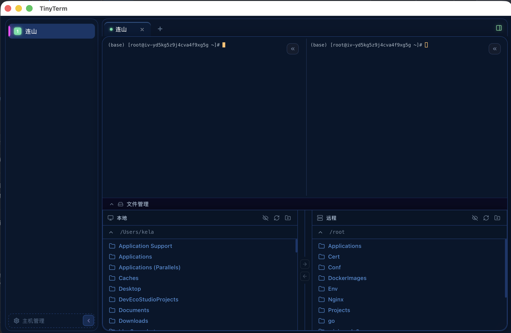
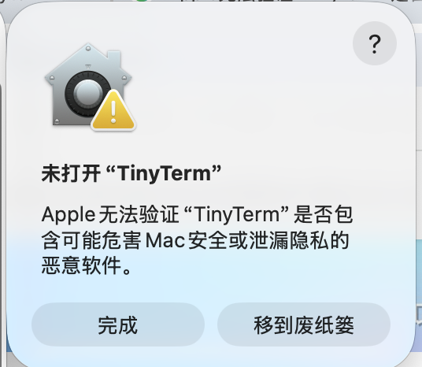

# TinyTerm


一个基于 Tauri + React 的轻量级桌面 SSH 客户端。

## 功能

- 多主机管理
- 密码 / 私钥认证
- 多标签终端
- 本地/远端文件管理（SFTP）
- 文件上传下载

## 开发

```bash
npm install
npm run tauri dev
```

## 打包

```bash
npm run tauri build
```

构建产物位于 `src-tauri/target/release/bundle/`。

## macOS 安装说明

TinyTerm 尚未通过 Apple 公证，首次打开时 macOS 会提示“Apple 无法验证 TinyTerm 是否包含可能危害 Mac 安全或泄露隐私的恶意软件”。这是未公证应用的正常安全提示，应用本身不包含恶意代码。



### 解决方法

1. 打开 **系统设置 → 隐私与安全性 → 安全性**
2. 在“已阻止使用 TinyTerm，因为来自身份不明的开发者”一栏点击 **“仍要打开”**（部分系统版本显示为 **“允许打开”**）
3. 再次启动 TinyTerm 即可正常使用

> 仅首次安装需要此操作，之后启动不会再次提示。

## 许可证

MIT
